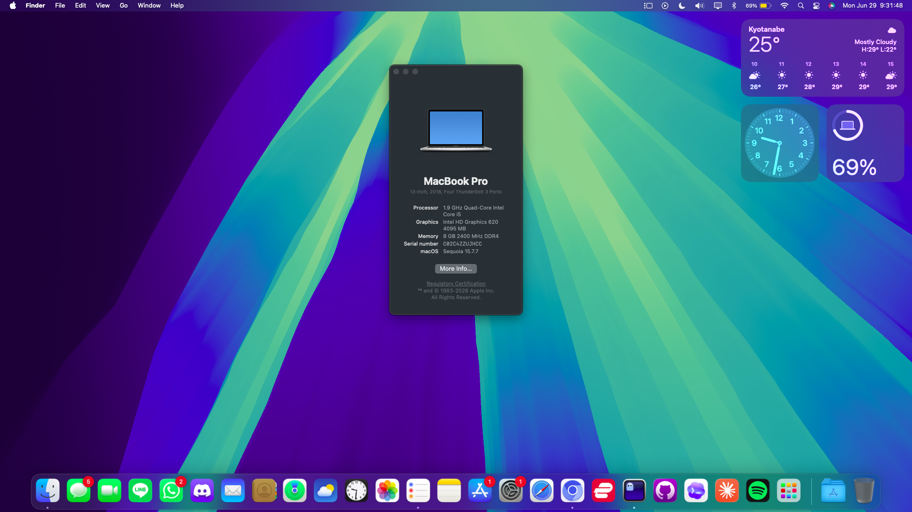

  
<h1>A guide for installing macOS 15 on a ThinkPad T480</h1>

A complete guide for installing <a href="https://apps.apple.com/us/app/macos-sequoia/id6596773750?mt=12">macOS</a> Sequoia on the <a href="https://www.lenovo.com/us/en/p/laptops/thinkpad/thinkpadt/thinkpad-t480/22tp2tt4800?srsltid=AfmBOooXFtlhLQXZFbJswnsfmBPZG1QH3bZPpnrvW3ITn5nMiqsZHqEH">ThinkPad T480</a> from start to finish using <a href="https://dortania.github.io/OpenCore-Install-Guide/">OpenCore</a> as the bootloader, including a guide for undervolting via <a href="https://github.com/sicreative/voltageshift">VoltageShift</a>, WiFi patching via <a href="https://github.com/laobamac/OCLP-Mod">OCLP Mod</a>.

 

---

### Things You Need
1. A working ThinkPad T480.
2. A working Windows computer this can be your ThinkPad too.
3. A 4gb usb drive, **You can use a sd card if you have a sd card to usb attableter since the t480 sd card slot is not loaded in opencore's boot menu and in BIOS**.
4. Some time to get things working.

|working|not working|not tested|
|--|--|--|
|||
|||
|||
|||
|||
|||
|||
|||
|||
